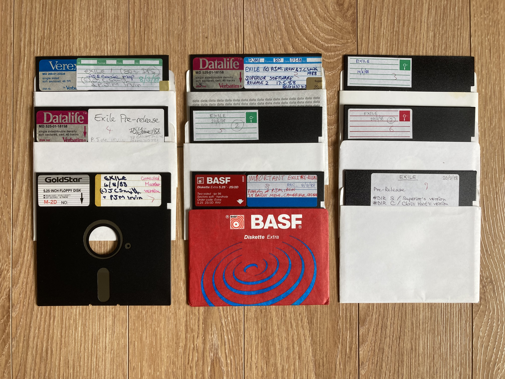
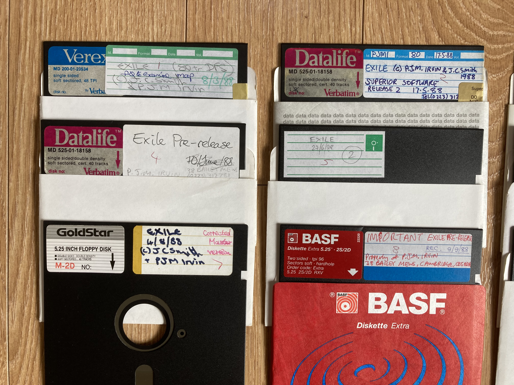
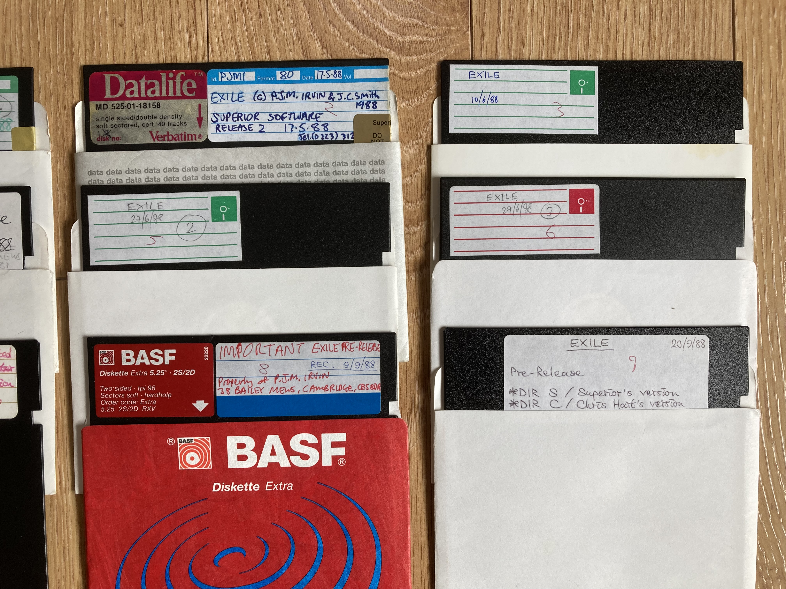

# The Exile Archive

Exile for the BBC Micro/Acorn Electron, (c) Peter J.M. Irvin and Jeremy C. Smith 1988. Published by Superior Software 1988.

An archive of pre-release Exile related builds, files and information. BBC Micro and Acorn Electron

# The Superior Software Exile disks

Re-archived / preserved by Kevin Edwards using the original floppy disks, February 2025.

Here's some more background information that I have put together based on my knowledge so far...

History
-------

Superior Software published many games for the BBC Micro and Acorn Electron during the 1980s. They didn't develop games themselves, but published games that were sent to them by freelance programmers/developers.

Demos and updated versions of the games would be posted to Superior every few weeks so that they could evaluate them and suggest ways in which they could be improved.

The developers would receive feedback letters detailing the suggestions and would do their best to implement the changes. This process went on until the game was ready for publishing.

Games could take anywhere between 3 and 12 months to develop.

Taking into account all the games that were published, and the fact that Superior were selling BBC Micro games for about 8 years, they must have received a few thousand disks during this time.

When a game was ready for release 'master maker' disks are produced that save out the tape file images, usually with some kind of software protection applied. These are what the tape duplication companies use to mass produce the tapes.

Some time in the late 1990s about 300 of the Superior disks were preserved/archived by an unknown person. How they gained access to the Superior Software disk archive is still a mystery.

One story suggested that they were found after being dumped in a skip and that's how they leaked. However, I have been told that this was definitely NOT the case.

This disk archive was kept private until early 2025.

My side story....A couple of years ago someone posted some photos of my own demo build disks for Galaforce/2. These were early builds of the game that I'd sent to Superior.

To cut a long story short, in early 2025 I was finally able to get hold of my old disks from them, along with some Exile ones. Apparently, they were being sold as 'blanks' by someone many years ago and the current owner has had them since then.

I published photos of these disks ( Exile and Galaforce ) in early 2025 and the whole story about the Superior disk archive suddenly became public.

Shortly after this the entire 300 disk collection was made public by an unknown person - it wasn't me by the way just in case you're wondering!

Anyway, amongst these 300 archived disks were 9 which had early builds of Exile for the BBC Micro.

I decided to re-archive the 9 original Exile disks that I had been sent and compare them against the ones in the archive that had been made public. A binary comparison showed they were different!

Whoever had imaged the disks in the 1990s hadn't done a great job and the blank ( unformatted ) sectors were polluted from other disk images. Eg. archived Exile disks had bits of Firetrack source code in them!?!

I decided clean archive images of the original disks was necessary to make the preservation correct. This is what I have provided here in this archive, along with more information / images.

I have also included photos of the original floppy disks to add to the history of the disks.

There are 9 EXILE folders numbered 1 to 9. Within each folder you will find the following:-

* A .dsd or .ssd containing the floppy disk image data. You can load this into an emulator or store it on a USB stick for use in a GoTek / floppy disk emulator.
* Photo(s) of the original floppy disk ( .JPG format ) 
* A folder named EXPORTED_FILES. This contains an export of all the individual files on the floppy disk. These are in sub-folders DRIVE0, and if relevant, DRIVE2.

All disk images are in Acorn DFS format, 80T. Some are doubled-sided.

Disk Image	  Dated  		  DiskFormat	   Description / additional information

* EXILE1		 8/ 3/88	80T/DS		f0 to 'examine' map ( BG collision OFF )
* EXILE2		17/ 5/88	80T/DS		Game files missing and therefore incomplete. Also multiple faults on disk image. Ignore! Added for completeness.
* EXILE3		10/ 6/88	80T/SS	
* EXILE4		25/ 7/88	80T/SS	
* EXILE5		27/ 6/88	80T/SS
* EXILE6		29/ 6/88	80T/SS
* EXILE7	 	 4/ 8/88	80T/DS		Drive 2 blank.
* EXILE8	 	 9/ 9/88	80T/DS		Drive 0 files duplicated on drive 2. Drive 0 has a saved game 'S.FRED1'
* EXILE9		20/ 9/88	80T/SS

These pre-release game builds have a 'password' lock that stops you from the leaving the ship at the start of the game. Here are the password key-presses that have been discovered so far...

Huge thanks to Rich Talbot-Watkins for assisting with these!

Run the game then type in the password then press the switch ( this unlocks the airlock doors )

Disk Image	Password

* EXILE1		f4-f5-f9-f4
* EXILE2		N/A
* EXILE3		207 <Return>
* EXILE4		209 <Return>
* EXILE5		208 <Return>
* EXILE6		
* EXILE7		210 <Return>
* EXILE8	
* EXILE9	

# General Notes

These files are provided as reference material and cannot be used, in part or whole, for financial gain/benefit.

All pull requests will be respectfully declined.

I do not plan to maintain this code in the future. However, additions/changes may be made to help tidy up, expand or explain the archive in more detail.

# Credits and acknowledgements

Thank you to the following people for making this archive possible:-

* Peter J.M. Irvin and Jeremy C. Smith ( RIP ), the original authors of Exile.
* Peter Irvin for giving his blessing to share these early builds. Sadly, he no longer has any of his original development disks.
* The previous owner of these disks who passed them to me for arcvhiving / recovery.
* Rich Talbot-Watkins for working out many of the passwords!

I hope you enjoy the archive!

Kevin Edwards, May 2025.
